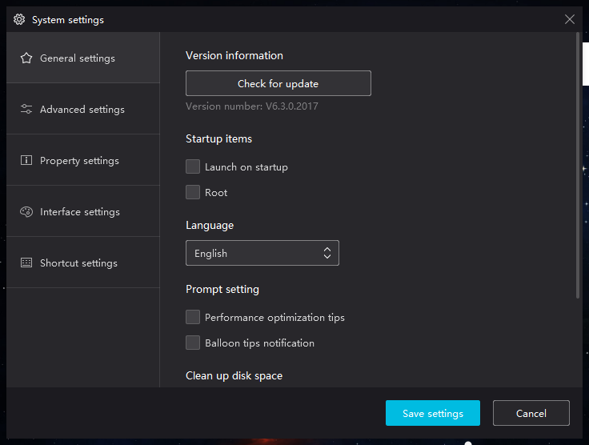
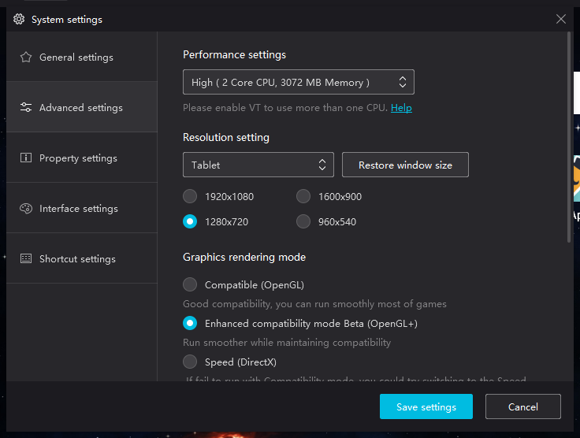
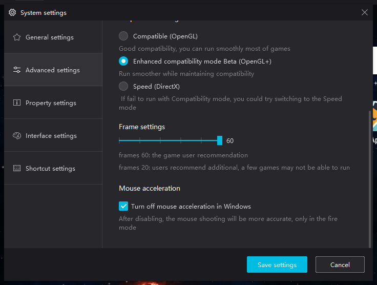
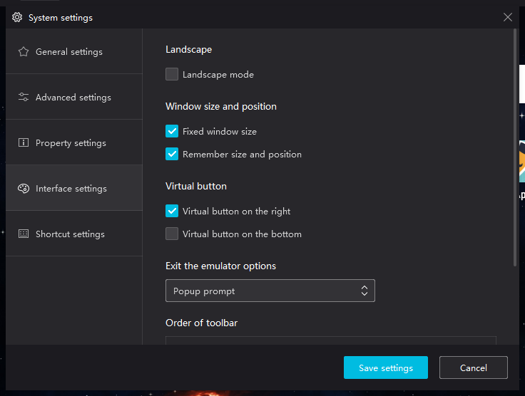
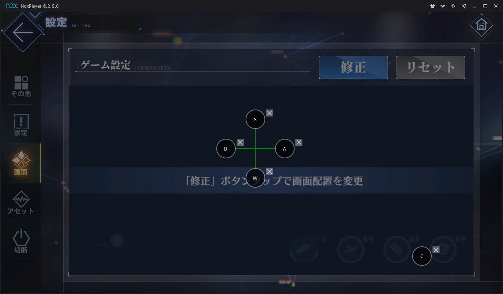
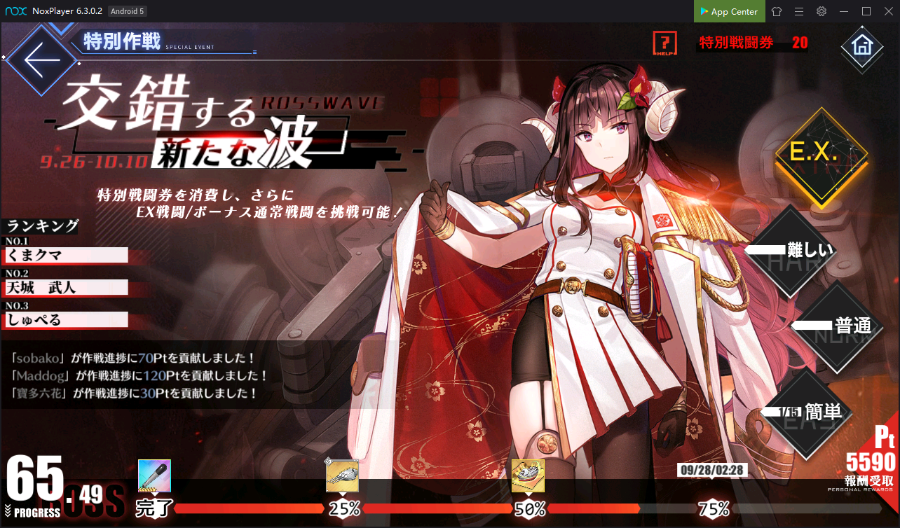
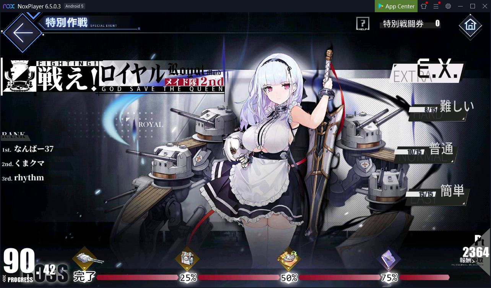
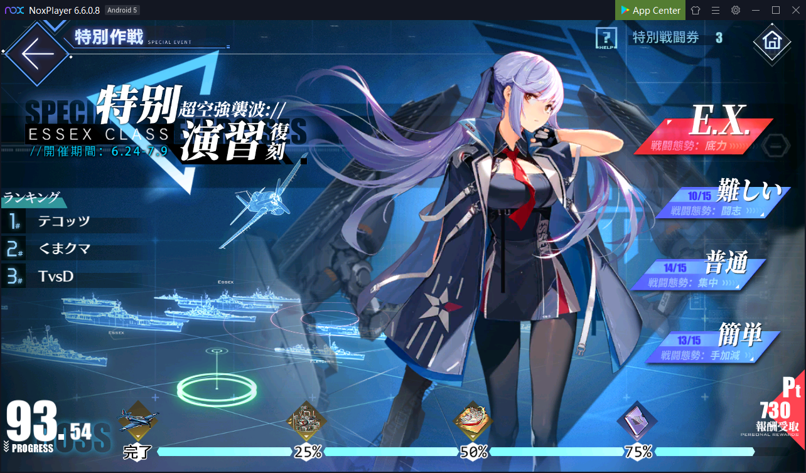
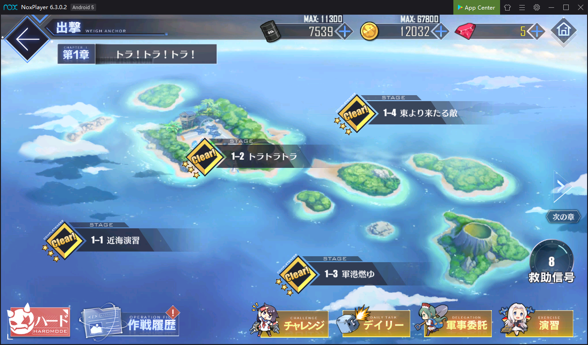

# AzurLaneBot

Python bot for lazy people to play [AzurLane](https://azurlane.yo-star.com/) (JP server)

## Requirement

- Use Windows 10
- Support Python 3.X.X
- Support PyAutoGUI

## Installation

* Download free Android emulator from [NoxPlayer](https://www.bignox.com/)

* Install in to your Windows

* Enable [virtualization](https://support.bluestacks.com/hc/en-us/articles/115003174386-How-can-I-enable-virtualization-VT-on-my-PC-)

* Follow the settings:

  
      
  
      
  
      
  

* Setup keyboard config for AzurLane by copying `keyboard_control\com.YoStarJP.AzurLane` to the following folder:

  ```shell
  C:\Users\USER_NAME\AppData\Local\Nox\keyboardConfig
  ```

* The result should be like this:

  

---

## Mode

Start bot by typing following commands in this current directory

### Crossing Waves

Run Bot for `Ex n times`, `Hard n times`, `Normal n times`, `Easy n times`

1. Go to event screen:

  

2. Enter command (Example: run each difficulties for 15 times)

  ```shell
  $ py .\crossing_waves.py 15 15 15 15
  ```

⚠️ **WARNING** ⚠️ Make sure that you have enough `Special Pass` tokens for extra rounds. The bot will use up all the tokens based on how many running times you type for each difficulties.

---

### HMS 2nd

Run Bot for `Ex n times`, `Hard n times`, `Normal n times`, `Easy n times`

1. Go to event screen:



2. Enter command (Example: run each difficulties for 15 times)

  ```shell
  $ py .\hms_2.py 15 15 15 15
  ```

⚠️ **WARNING** ⚠️ Make sure that you have enough `Special Pass` tokens for extra rounds. The bot will stop working since it would not handle the token popup.

---

### Air Raid Drills with Essex

Run Bot for `Ex n times`, `Hard n times`, `Normal n times`, `Easy n times`

1. Go to event screen:



2. Enter command (Example: run each difficulties for 15 times)

  ```shell
  $ py .\air_raid_drills_with_essex_mode.py 15 15 15 15
  ```

⚠️ **WARNING** ⚠️ Make sure that you have enough `Special Pass` tokens for extra rounds. The bot will stop working since it would not handle the token popup.

---

### Rescue Mode

1. Go to weigh anchor screen:

  

2. Enter command in terminal

  ```shell
  $ py .\rescue_mode.py
  ```

⚠️ **WARNING** ⚠️ Make sure that you scanned rescue signals. The bot will go through all the rescue signals in the signal list only.
